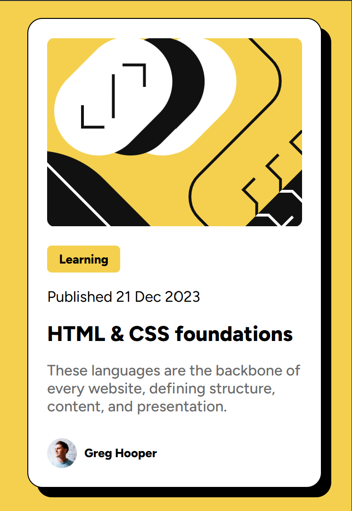

# Frontend Mentor - Blog preview card solution

This is a solution to the [Blog preview card challenge on Frontend Mentor](https://www.frontendmentor.io/challenges/blog-preview-card-ckPaj01IcS). Frontend Mentor challenges help you improve your coding skills by building realistic projects. 

## Table of contents

- [Overview](#overview)
  - [The challenge](#the-challenge)
  - [Screenshots](#screenshots)
  - [Links](#links)
- [My process](#my-process)
  - [tools used](#tools-used)
  - [What I learned](#what-i-learned)
  - [Continued development](#continued-development)
  - [Useful resources](#useful-resources)
- [Author](#author)

**Note: Delete this note and update the table of contents based on what sections you keep.**

## Overview

### The challenge

Users should be able to:

- See hover and focus states for all interactive elements on the page

### Screenshots

### Links

- Solution URL: [https://github.com/faisalalmail/CH2-blog](https://github.com/faisalalmail/CH2-blog)
- Live Site URL: [https://ch-2-blog-card-preview.vercel.app/](https://ch-2-blog-card-preview.vercel.app/)

## My process

1. compared to challenge one, this time I created a seperate file for styles.
2. started by global reset and setting the body background.
3. imported font.
4. wrote the HTML code and divs
5. did the styling on CSS
6. tons of trouble shooting and little adjustments to match the provided design

### Tools-used

- HTML, CSS
- VS code
- GIT
- Github
- VERCEL

**Note: These are just examples. Delete this note and replace the list above with your own choices**

### What I learned

- the use of VW instead of PX for sizing allowing dynamic sizing
- clamb (min,pref,max)
- image object-fit css attribute

### Continued development

responsive design

### Useful resources

- [box shadow generator](https://cssgenerator.org/box-shadow-css-generator.html) - This helped me create the shadow style for the card.
- [object-fit css](https://developer.mozilla.org/en-US/docs/Web/CSS/object-fit) - I learned from this page the proper style property for my use.

## Author

My name is Faisal - A 35 year old guy from a small island in the middle of the world called Bahrain. I had the passion to code and practiced with html and PHP long ago. I stopped then, but the passion never died. and this could be my way to return.

- Instagram - [Faisal Almail](https://www.instagram.com/faisal.almail)
- Frontend Mentor - [@FaisalAlmail](https://www.frontendmentor.io/profile/faisalalmail)

